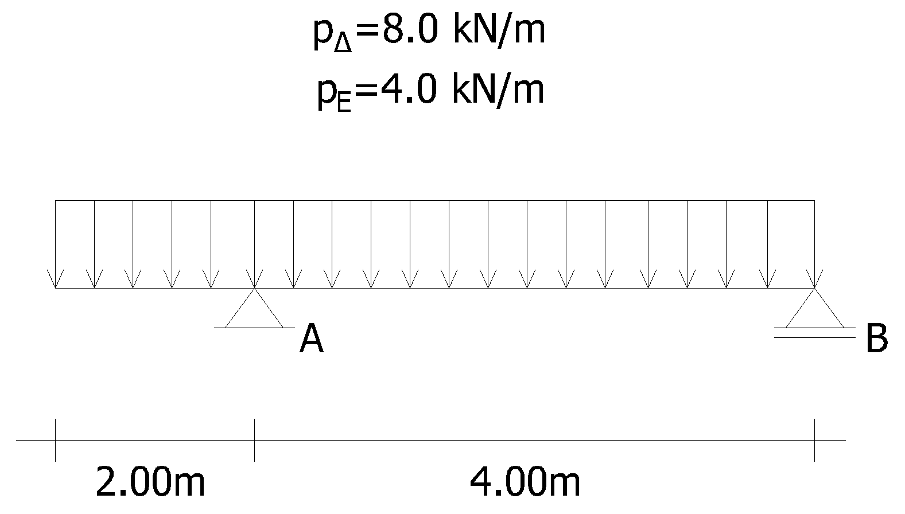
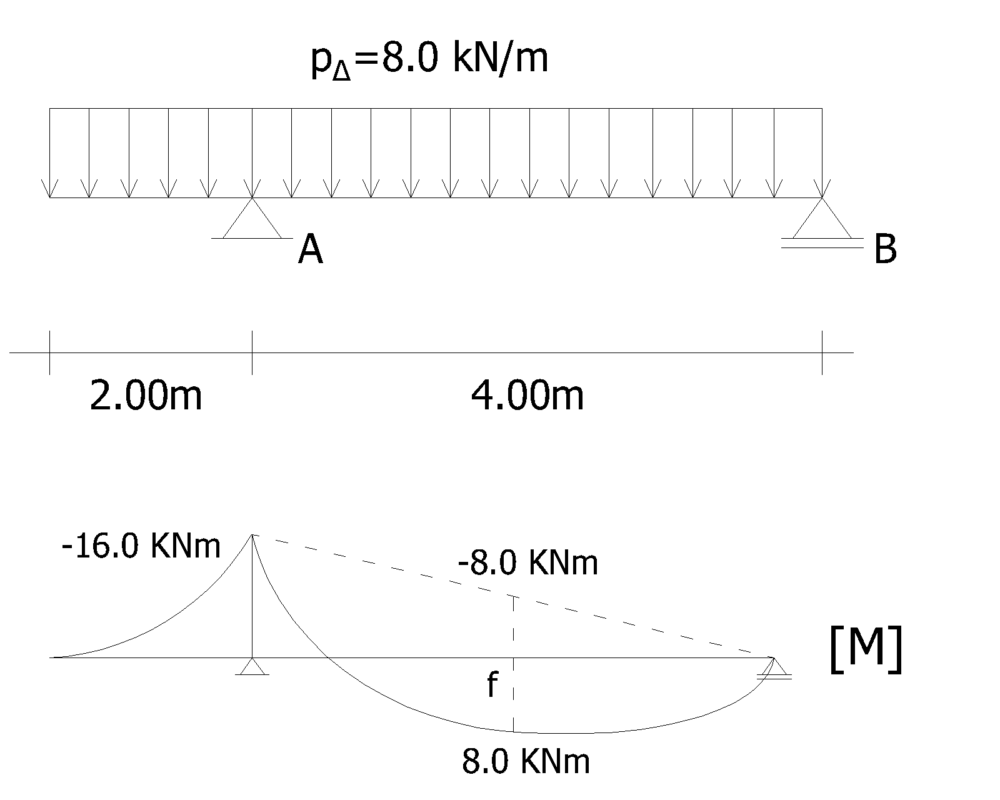
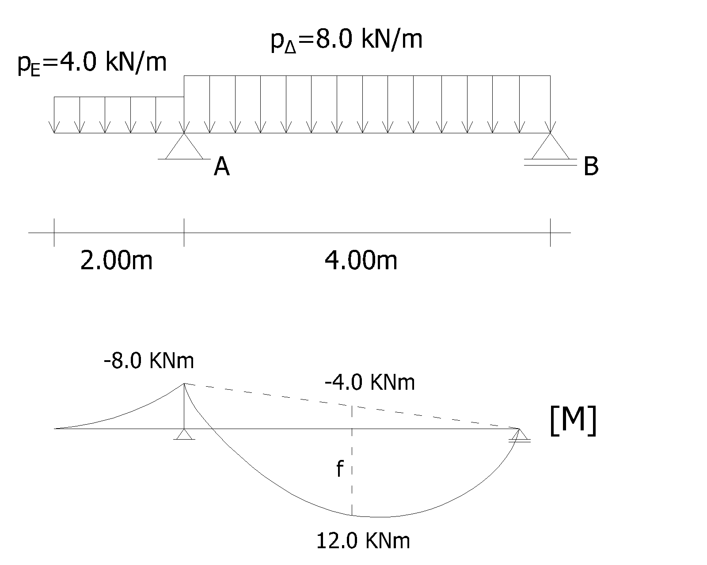

# Παράδειγμα χρήσης εναλλακτών φορτίσεων σε δοκό

Δίνεται η μονοπροέχουσα δοκός του σχήματος η οποία καταπονείται από ομοιόμορφα φορτία, για τα οποία ο δυσμενής συνδυασμός φόρτισης στον ΟΚΑ έχει τιμή $p_{\Delta}=8.0\text{kN/m}$ ενώ ο ευμενής συνδυασμός είναι $p_{E}=4.0\text{kN/m}$

<!--  -->

```{figure} images/enal/ekfonisi.png
---
width: 500px
---
Εκφώνηση
```

Να υπολογιστούν οι μέγιστες τιμές των ροπών που μπορεί να εμφανιστούν σε άνοιγμα και στηρίξεις.

α) Χρησιμοποιώντας καθολική φόρτιση με το δυσμενή συνδυασμό $p_{\Delta}$  
β) Χρησιμοποιώντας εναλλακτές φορτίσεις

## Εφαρμογή καθολικής φόρτισης με το δυσμενή συνδυασμό

Η ροπή στην στήριξη Α (πρόβολος) δίνεται από τη σχέση:

$M_A=-p_{\Delta}\cdot\dfrac{L_{πρ}^2}{2}=-8.0\text{kN/m}\cdot\dfrac{(2.0\text{m})^2}{2}=-16.0\text{kNm}$

Η ροπή στην στήριξη Β είναι προφανώς μηδενική (ακραία στήριξη)

Η ροπή στο μέσο του ανοίγματος ΑΒ υπολογίζεται από τη σχέση:

$M_{AB,μέσο}=\dfrac{M_A+M_B}{2}+\dfrac{p\cdot L^2}{8}=$

$=\dfrac{-16.0\text{kNm}+0.0\text{kNm}}{2}+\dfrac{8.0\text{kN/m}\cdot (4.0\text{m})^2}{8}=8.0\text{kNm}$


```{figure} images/enal/katholiki.png
---
width: 550px
---
Διάγραμμα ροπών
```

<!-- {style=background:white;width:550px}  -->

## Εφαρμογή εναλλακτών φορτίσεων

### Μέγιστη ροπή στην στήριξη Α

Για να αναπτυχθεί η μέγιστη ροπή σε έναν πρόβολο θα πρέπει να ασκηθεί το δυσμενές φορτίο σε αυτόν, χωρίς να μας ενδιαφέρει η φόρτιση του υπόλοιπου φορέα. Έτσι, ομοίως με την προηγούμενη περίπτωση προκύπτει:

$M_A=-p_{\Delta}\cdot\dfrac{L_{πρ}^2}{2}=-8.0\text{kN/m}\cdot\dfrac{(2.0\text{m})^2}{2}=-16.0\text{kNm}$

### Μέγιστη ροπή στο άνοιγμα ΑΒ

Η μέγιστη ροπή στο άνοιγμα αναπτύσσεται όταν η φόρτιση είναι σύμφωνα με το σχήμα:

Στην περίπτωση αυτή, η ροπή στην στήριξη του προβόλου (Α) είναι:
$M_A=-p_{E}\cdot\dfrac{L_{πρ}^2}{2}=-4.0\text{kN/m}\cdot\dfrac{(2.0\text{m})^2}{2}=-8.0\text{kNm}$

Οπότε η ροπή στο μέσο του ανοίγματος ΑΒ υπολογίζεται από τη [σχέση](#moment_beam_middle):

$M_{AB,μέσο}=\dfrac{M_A+M_B}{2}+\dfrac{p_{\Delta}\cdot L_{AB}^2}{8}=\dfrac{-8.0\text{kNm}+0.0\text{kNm}}{2}+\dfrac{8.0\text{kN/m}\cdot (4.0\text{m})^2}{8}=12.0\text{kNm}$

Παρατηρείται ότι η τιμή αυτή είναι μεγαλύτερη από αυτήν που προέκυψε στην περίπτωση που εφαρμόστηκε η καθολική φόρτιση με το δυσμενή συνδυασμό

<!-- {style=background:white;width:550px}  -->
